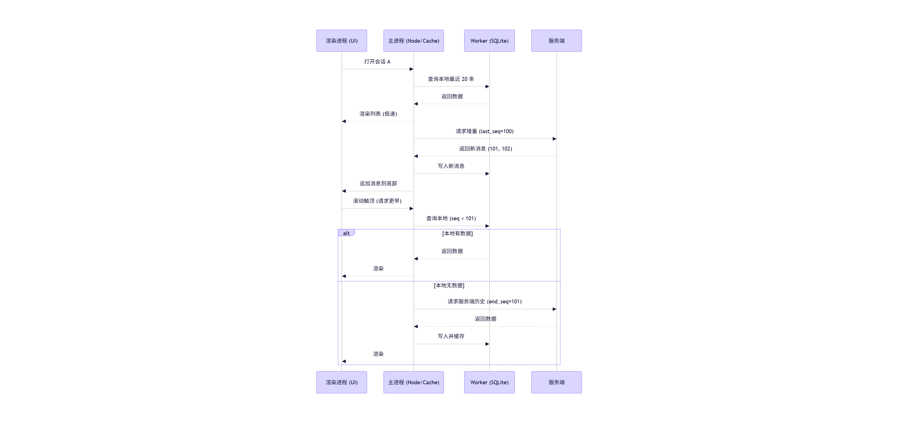
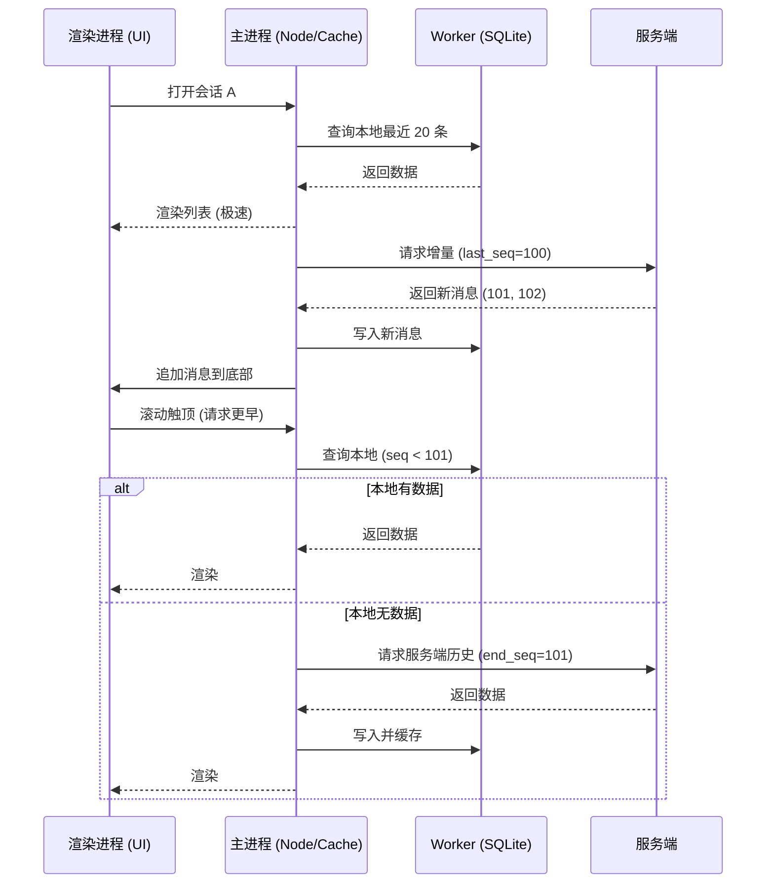

# 💬 即时通讯核心业务流程说明

本文档基于最新的 Prisma Schema 设计，详细描述了系统中**私聊**与**群聊**的核心业务逻辑流转。

## 📋 核心概念定义

- **会话:** 聊天行为发生的载体。无论是私聊还是群聊，在系统中都抽象为一条 `Conversation` 记录。
- **私聊:** 两个用户之间的通信。其 `Conversation` 的 `target_id` 指向对方用户 ID。
- **群聊:** 多个用户之间的通信。其 `Conversation` 的 `target_id` 指向群组 ID。
- **消息:** 具体的聊天内容，归属于某个 `Conversation`。
- **本地缓存:** 客户端使用 SQLite 存储会话和消息，以实现秒开体验和离线查看。

---

## 🤝 场景一：私聊流程

<!-- **前提条件:** 用户 A 和用户 B 互为好友（或系统允许陌生人发起会话）。 -->

### 1. 发起会话 (延迟创建)

当用户 A 在联系人列表中点击用户 B 时，系统采用**延迟创建**策略。

**1.1 生成确定性 ID:**
客户端根据双方 ID 生成唯一的 `conversation_id`：
`ID = md5(sort([A.id, B.id]).join('_'))`

**1.2 开启临时会话:**

- 客户端首先在本地数据库查询该 ID。
- 如果存在，加载历史消息。
- 如果不存在，UI 进入"临时会话"状态，不立即调用后端创建接口。

### 2. 发送消息 (触发创建)

用户 A 发送第一条消息时，正式触发会话创建。

**2.1 客户端处理:**

- 客户端将消息存入本地 SQLite，状态设为 `sending`。
- 调用 `SendMessage` IPC 接口。

**2.2 后端处理 (自动创建):**

- 后端收到消息请求，首先检查 `conversation_id` 是否已存在。
- 如果不存在：
  - 在 `Conversation` 表创建新记录。
  - 在 `ConversationParticipant` 表为双方创建关联。
- 保存消息至 `MessageHistory` 表。
- 返回成功响应及完整的会话/消息对象。

**2.3 状态同步:**

- 客户端收到响应，更新本地消息状态为 `success`。
- 如果是首条消息，将临时会话转为正式会话。

---

## 💾 本地数据同步策略

为了保证性能与数据一致性，采用以下同步方案：

### 1. 列表加载 (先本地后线上)

1. **加载本地:** UI 启动时，立即从本地 SQLite 读取 `Conversation` 列表并展示。
2. **异步对齐:** 客户端调用后端 `GetConversationList` 接口。
3. **增量更新:**
   - 遍历后端返回的列表，对比 `update_time`。
   - 如果线上 `update_time > 本地 update_time`，则更新本地记录并通知 UI 刷新。

### 2. 消息同步

- 进入具体聊天窗口时，先展示本地 `MessageHistory`。
- 向后端请求该会话的最新消息（带上本地最后一条消息的时间戳）。
- 后端返回该时间戳之后的增量数据。
- 客户端存入本地并更新 UI。

### 3. 接收与展示

用户 B 收到消息。

**3.1 本地存储:** B 的客户端收到 WebSocket 推送，将消息写入本地 SQLite 的 `MessageHistory` 表。

**3.2 列表更新:** 更新本地 `Conversation` 列表，将该会话置顶（按 `last_msg_time` 排序），并增加未读数。

**3.3 UI 渲染:** 聊天窗口显示新消息气泡。

### 4. 结束/删除会话

用户 A 决定不再查看此聊天，点击"删除会话"。

**4.1 软删除:** 客户端调用后端接口。

**4.2 更新状态:** 后端更新 `ConversationParticipant` 表：

- 条件：`conversation_id = ...` AND `user_id = A.id`
- 动作：设置 `is_deleted = true`。

**4.3 结果:** A 的聊天列表中不再显示该会话，但 `MessageHistory` 依然保留，且 B 的列表不受影响。

---

## 👥 场景二：群聊流程

**前提条件:** 用户 A 创建了一个群，并拉入用户 B 和 C。

### 1. 进入群聊

用户 A 点击群聊入口。

**1.1 获取会话:**

- 查询 `Conversation` 表，条件：`type = 2` (群聊) AND `target_id = 群ID`。
- 如果不存在（首次创建群时），则创建 `Conversation` 记录，`target_id` 指向 `Group.id`。

**1.2 权限校验:** 检查 `GroupMember` 表，确认 A 在该群的状态是否为 `0` (正常)。

### 2. 发送消息

用户 A 发送一条图片消息。

**2.1 客户端请求:** 发送 `{ type: 1 (图片), url: "...", conversationId: "..." }`。

**2.2 后端处理:**

- **保存消息:** 在 `MessageHistory` 表插入记录：
  - `sender_id`: A 的 ID
  - `conversation_id`: 群会话 ID
  - `content`: 图片 URL
- **更新会话快照:** 更新 `Conversation` 表的 `last_msg_content` 为 "[图片]"，更新时间戳。
- **实时推送:** 后端通过 WebSocket 向该 `conversation_id` 下的**所有**在线参与者（B 和 C）推送消息。

### 3. 修改群设置

用户 A（群主）修改群名为"技术交流群"。

**3.1 更新资料:** 后端更新 `Group` 表：

- `name`: "技术交流群"

**3.2 通知成员:**

- 发送一条系统类型的消息到 `MessageHistory`（可选，用于在聊天流显示"A 修改了群名"）。
- 通过 WebSocket 推送 `update_group_info` 事件，让 B 和 C 的客户端更新本地群信息缓存。

### 4. 退出群聊

用户 B 决定退出群聊。

**4.1 更新成员状态:** 后端更新 `GroupMember` 表：

- 条件：`group_id = ...` AND `user_id = B.id`
- 动作：设置 `state = -1` (退出)。

**4.2 清理会话:**

- 可选操作：更新 `ConversationParticipant` 表，设置 B 的 `is_deleted = true`。

**4.3 结果:** B 不再接收该群的新消息，群成员列表更新。

---

## 📊 数据库字段映射速查表

| 业务动作       | 涉及表                    | 关键字段/操作                             |
| -------------- | ------------------------- | ----------------------------------------- |
| **创建私聊**   | `Conversation`            | `type: 1`, `target_id: 对方UserID`        |
| **创建群聊**   | `Conversation`            | `type: 2`, `target_id: 群ID`              |
| **发送消息**   | `MessageHistory`          | `conversation_id`, `sender_id`, `content` |
| **更新列表**   | `Conversation`            | 更新 `last_msg_content`, `last_msg_time`  |
| **个性化设置** | `ConversationParticipant` | `is_top` (置顶), `is_disturb` (免打扰)    |
| **删除会话**   | `ConversationParticipant` | 设置 `is_deleted: true`                   |
| **群成员管理** | `GroupMember`             | `role` (角色), `state` (状态)             |

---

## 💡 开发者注意事项

1. **私聊 ID 一致性:** 务必在后端封装一个工具函数来生成私聊 `conversation_id`，确保无论谁发起，ID 都是固定的。
2. **数据冗余:** `Conversation` 表中的 `last_msg_content` 是冗余字段。在发送消息的事务中，必须同时更新 `MessageHistory` 和 `Conversation` 表，以保证聊天列表展示的实时性。
3. **索引优化:** 查询消息历史时，务必使用 `conversation_id` + `create_time` 的联合索引进行分页查询，以保证性能。
4. **事务处理:** 在发送消息等关键操作中，使用数据库事务保证数据一致性。
5. **实时性:** 利用 WebSocket 实现消息的实时推送，提升用户体验。
6. **安全性:** 在群聊场景中，发送消息前务必校验用户是否为群成员，防止非法消息发送。

---

# 针对基于 Electron + Better-SQLite3 的 IM 语聊系统，设计“本地+服务端”双端缓存与同步机制，核心原则是：**“本地优先渲染，后台静默同步，增量更新，冲突以服务端为准”**。

以下是结合业界最佳实践（如 OpenIM、微信架构）设计的详细逻辑方案：

### 🚀 核心策略概览

| 数据维度     | 本地数据库 (Better-SQLite3)                            | 服务端数据库 (mysql)                             | 同步策略                                          |
| :----------- | :----------------------------------------------------- | :----------------------------------------------- | :------------------------------------------------ |
| **会话列表** | 缓存最近联系人、未读数、最后一条消息摘要               | 存储全量关系链、群组信息                         | **本地加载 + 增量拉取** (基于 `last_update_time`) |
| **聊天历史** | 仅存储当前用户可见的历史消息 (分页存储)                | 存储全量消息 (永久存储)                          | **按需加载** (滚动到底部加载) + **实时推送**      |
| **消息状态** | 存储 `is_read` (本地已读), `status` (发送中/成功/失败) | 存储 `read_seq` (已读游标), `max_seq` (最大游标) | **读写分离** (本地乐观更新，服务端同步游标)       |

---

### 📂 一、会话列表 (Conversation List)

会话列表要求**启动快**、**未读数准**。

#### 1. 加载逻辑

1.  **应用启动/登录**：
    - **第一步（极速渲染）**：直接从 **Better-SQLite3** 读取最近的 50-100 个会话。
      - _SQL:_ `SELECT * FROM conversations ORDER BY last_msg_time DESC LIMIT 100`
    - **第二步（后台同步）**：建立 WebSocket 连接后，立即调用服务端接口 `syncConversationList(last_local_update_time)`。
2.  **数据合并**：
    - 服务端返回新增或变更的会话列表。
    - 客户端遍历更新本地 SQLite 数据库。
    - **UI 刷新**：利用 React/Vue 的响应式特性，数据库变动后自动刷新列表。

#### 2. 同步时机

- **实时推送**：当收到新消息（WebSocket 事件）时，**不要**只更新消息表，要同时**更新会话表**（更新 `last_msg_content`, `last_msg_time`, `unread_count + 1`），并将会话置顶。
- **多端同步**：如果手机端读了消息，服务端通过 WebSocket 推送 `ConversationUpdate` 事件， Electron 收到后更新本地 SQLite 的 `unread_count` 为 0。

---

### 💬 二、聊天历史 (Message History)

聊天历史数据量大，不能一次性拉取，采用**“懒加载 + 增量同步”**。

#### 1. 进入会话时的加载 (懒加载)

当用户点击某个会话（例如 `session_id = 'user_1001'`）：

1.  **检查本地游标**：
    - 读取本地记录的该会话最大消息序列号 `local_max_seq`。
2.  **读取本地数据库**：
    - 立即从 SQLite 加载最近 20 条消息用于渲染。
    - _SQL:_ `SELECT * FROM messages WHERE session_id = ? ORDER BY seq DESC LIMIT 20`
3.  **拉取服务端增量 (如有)**：
    - 请求服务端：`GET /messages/history?session_id=user_1001&min_seq=local_max_seq`。
    - 如果服务端返回了新消息（说明本地断连期间有消息），写入 SQLite，并追加到 UI 列表底部。

#### 2. 滚动加载更多 (分页加载)

当用户向上滚动（查看更早消息）：

1.  **触发条件**：滚动条触顶。
2.  **查询本地**：
    - 先查 SQLite 是否有更早的数据（例如查当前页之前的 20 条）。
    - 如果本地有，直接渲染（**0 延迟**）。
3.  **请求服务端**：
    - 如果本地数据到底了（例如本地最早一条是 `seq=100`），则请求服务端：`GET /messages/history?session_id=...&end_seq=100&limit=20`。
    - 拿到数据后，写入 SQLite，并插入到 UI 列表顶部。

---

### ⚡ 三、数据同步与冲突处理

#### 1. 消息发送（乐观更新）

1.  **UI 层**：用户发送消息，立即在 UI 显示，状态为“发送中”。
2.  **本地 DB 层**：
    - 写入 SQLite，生成一个临时的 `client_msg_id`，状态 `SENDING`。
3.  **网络层**：发送给服务端。
4.  **回调处理**：
    - **成功**：服务端返回真实的 `server_msg_id` 和 `seq`。更新 SQLite 状态为 `SENT`，替换临时 ID。
    - **失败**：更新 SQLite 状态为 `FAILED`，UI 显示红色感叹号。

#### 2. 消息接收（实时 + 补漏）

1.  **实时推送**：
    - WebSocket 收到新消息 -> 写入 SQLite -> 触发 UI 更新。
2.  **断线重连（补漏机制）**：
    - 重连成功后，客户端上报当前所有会话的 `max_seq`。
    - 服务端返回缺失的消息包。
    - 客户端批量写入 SQLite（注意去重，使用 `INSERT OR IGNORE`）。

#### 3. 已读状态同步 (红点逻辑)

这是最容易乱的，建议采用 **游标机制**：

- **服务端**：维护 `Read_Seq` (用户已读到的最大序列号)。
- **本地**：
  - **未读数计算**：`UnreadCount = (Session_Max_Seq) - (Local_Read_Seq)`。
  - **点击会话时**：
    1.  更新本地 `Local_Read_Seq` = `Session_Max_Seq`。
    2.  UI 上红点消失。
    3.  **异步**向服务端发送“已读回执”，更新服务端的 `Read_Seq`。

---

### 🛠️ 四、 Electron 架构落地建议

结合之前的 `Better-SQLite3` 和 `Worker` 架构：

1.  **数据库层 (Worker Thread)**
    - 封装 `MessageDAO` 和 `ConversationDAO`。
    - 提供 `getHistory(sessionId, anchorSeq, count)` 方法。
    - 提供 `syncMessages(messages[])` 方法（批量插入/更新）。

2.  **缓存层 (Main Process)**
    - 使用 `LRU Cache` 缓存当前打开的会话消息（例如最近 5 个会话的最近 50 条消息）。
    - **读取逻辑**：UI 请求 -> 查 LRU -> 无则查 SQLite -> 写入 LRU -> 返回。

3.  **同步管理器 (SyncManager)**
    - 单例模式，监听 WebSocket 事件。
    - 维护一个 `SyncQueue`，防止并发写入数据库。
    - **防抖处理**：短时间内收到多条消息，合并写入数据库，避免频繁 I/O。

### 📝 总结流程图

<!--  -->

