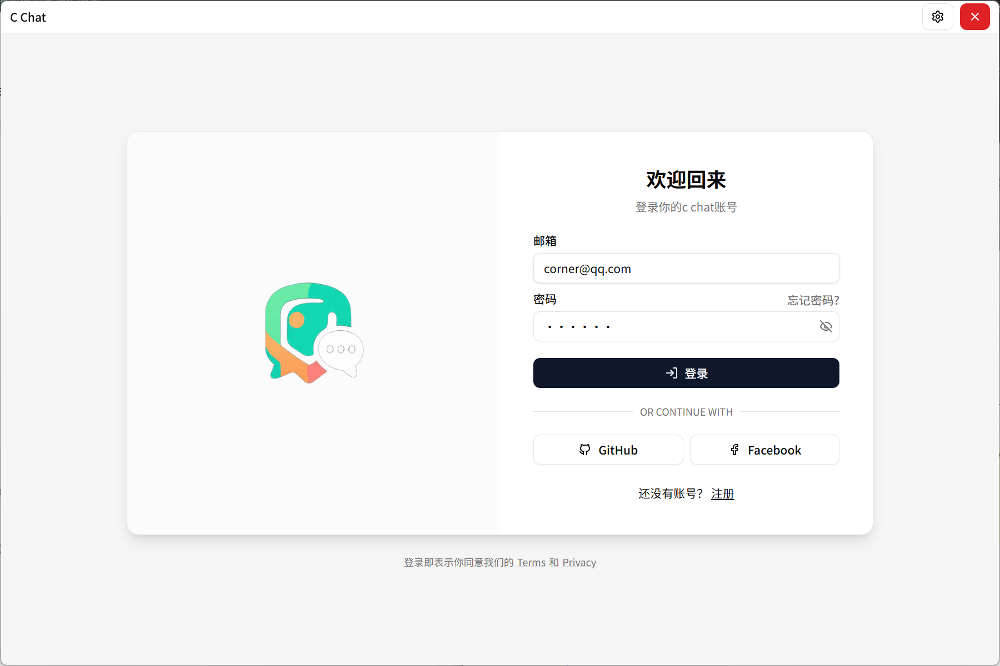
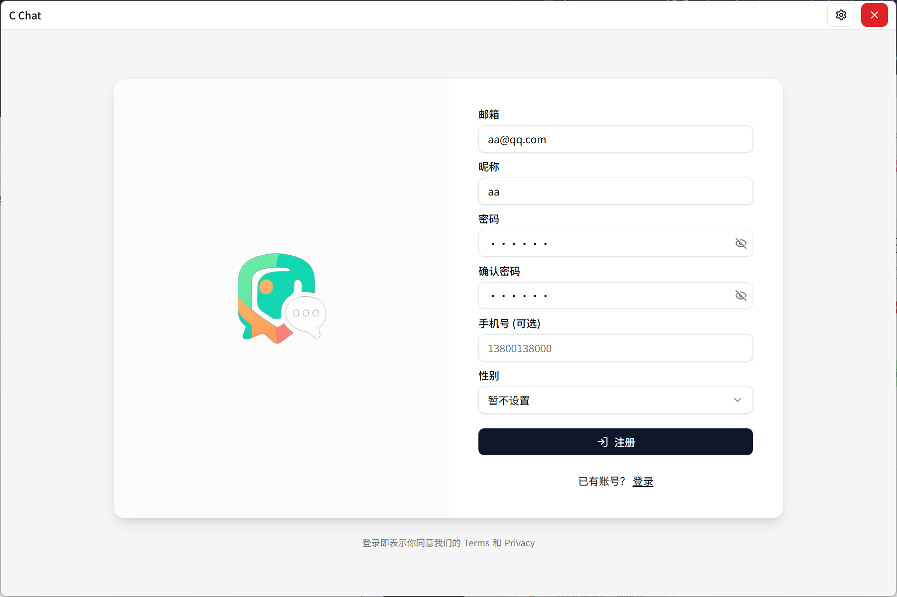
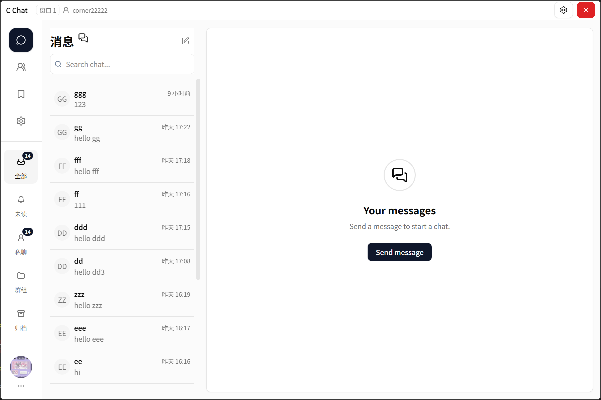
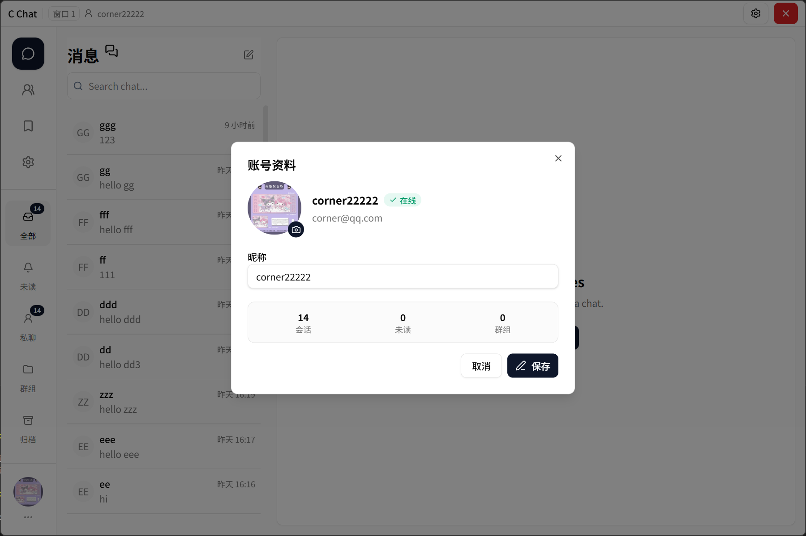
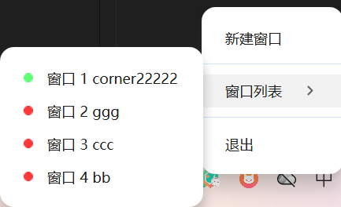

# Corner Chat 即时通讯桌面端

 `c_chat` 是一个桌面即时通讯应用项目，采用 Monorepo 组织，包含 Electron 客户端、React 前端和服务端。它的目标是提供一个可持续扩展的聊天产品，覆盖登录、会话、消息、文件传输和多窗口使用等常见场景。

---

## 📦 快速开始

#### 环境要求(本人本地环境，不一定严格要求)

- Node.js v24.7.0
- pnpm v9.0.0

#### 启动

```bash
#  clone 项目
git clone https://github.com/xieyongyi0614/c_chat.git
cd c_chat

# 安装依赖
pnpm install
# 启动
pnpm run dev


# 打包
pnpm run package
```

## 🛠 技术栈

### 前端架构

- **Monorepo**: Turborepo 统一项目管理
- **桌面应用**: Electron + React
- **UI 框架**: React + Tailwind CSS
- **构建工具**: Vite / Webpack

### 后端架构

- **服务框架**: NestJS
- **API 类型**: RESTful + WebSocket
- **数据库**: MySQL
- **ORM**: Prisma
- **认证**: JWT

## 🚀 功能特性

### 💬 消息功能

- [x] **实时消息传递** - 基于 WebSocket 的即时通讯
- [ ] **群聊功能** - 支持创建和加入多人聊天室
- [ ] **消息撤回** - 支持已发送消息的撤回操作
- [ ] **消息转发** - 支持消息转发给其他联系人
- [ ] **消息搜索** - 快速搜索历史消息记录
- [ ] **表情包支持** - 丰富的表情符号和 GIF 动图

### 📁 文件功能

- [x] **文件传输** - 支持图片、文档、音视频等文件分享
- [ ] **云端存储** - 文件云同步，跨设备访问
- [ ] **文件预览** - 图片、文档在线预览功能
- [x] **断点续传** - 大文件分片上传，支持断点续传

### 🎧 通讯功能

- [ ] **语音通话** - 高清一对一语音通话
- [ ] **视频通话** - 支持一对一视频聊天
- [ ] **屏幕共享** - 工作协作中的屏幕共享功能
- [ ] **语音转文字** - 语音消息自动转换为文字

### 👥 社交功能

- [ ] **好友系统** - 好友添加、删除、备注
- [ ] **联系人管理** - 分组管理联系人列表
- [ ] **用户资料** - 个人头像、昵称、个性签名
- [ ] **在线状态** - 显示好友在线/离线状态

### 🔄 多账号支持

- [x] **多窗口登录** - 可创建最多 10 个窗口登录不同账号
- [x] **托盘管理** - 通过系统托盘快速切换不同账号窗口

### 🌐 国际化

- [ ] **多语言支持** - 支持中文、英文等多种语言
- [ ] **自动语言检测** - 根据系统语言自动切换界面语言
- [ ] **语言切换** - 支持应用内手动切换语言
- [ ] **文化适配** - 时间格式、数字格式等本地化适配

### 🔒 安全功能

- [ ] **消息加密** - 端到端加密保护隐私
- [ ] **阅后即焚** - 设置消息自动销毁时间
- [ ] **消息验证** - 确保消息完整性和真实性
- [ ] **防骚扰设置** - 黑名单和免打扰功能

### ⚙️ 设置功能

- [ ] **主题切换** - 支持深色/浅色主题
- [ ] **通知设置** - 自定义消息提醒方式
- [ ] **快捷键** - 支持常用操作快捷键
- [ ] **数据备份** - 本地消息数据备份与恢复

> ⚠️ **TIPS**: 本项目正在积极开发中，功能持续更新迭代...

## 部分页面截图

1.  登录注册页面<br />
    [](./docs/img/signIn.png)
    [](./docs/img/signUp.png)

2.  聊天页面<br />
    [](./docs/img/chat.png)

3.  账号信息<br />
    [](./docs/img/userInfo.png)

4.  托盘多账号<br />
    [](./docs/img/tray.png)

## 📞 联系方式

如果您有任何问题、建议，欢迎随时联系我们：

- **问题反馈**: [Issues](https://github.com/xieyongyi0614/c_chat/issues)
- **功能建议**: [Issues](https://github.com/xieyongyi0614/c_chat/issues)

我们期待您的宝贵意见和建议！
